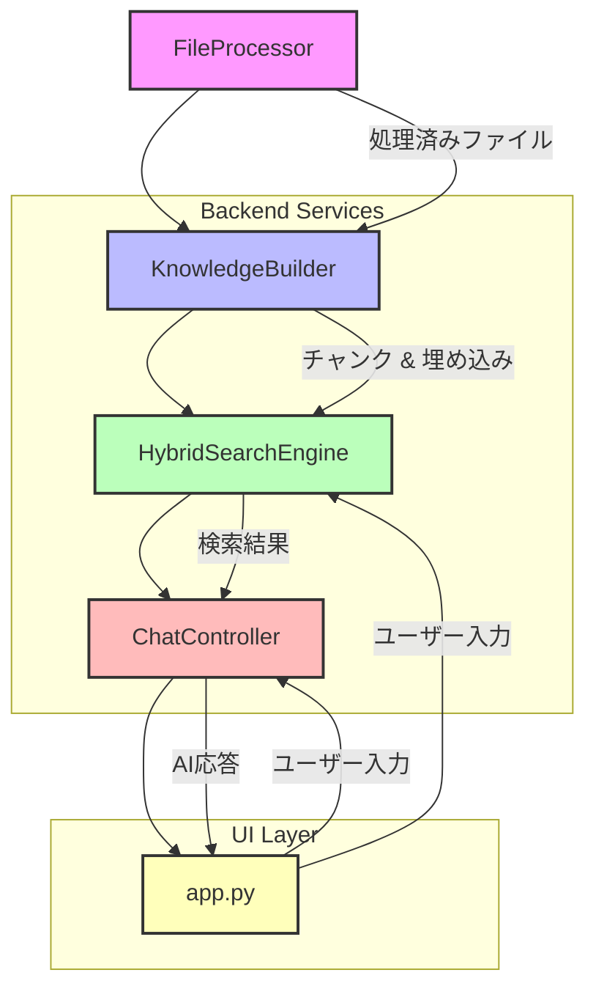

# KnowledgePlus: AIアシスタント統合ツール

KnowledgePlusは、ナレッジベース構築、検索、チャット、FAQ生成機能を統合したAIアシスタントアプリケーションです。Streamlitをベースに、OpenAIの埋め込み技術を活用し、独自のドキュメントに対する高度な情報活用を可能にします。

## 🚀 クイックスタート

### 依存関係のインストール

Choose the dependency set that fits your environment.

```bash
# Recommended two-step install from the repository root
scripts/install_light.sh
scripts/install_extra.sh  # add heavy libraries like torch only when needed

# Direct pip commands if you prefer
pip install -r requirements-light.txt
pip install -r requirements-extra.txt
```
The `requirements-extra.txt` file holds large libraries such as **torch** and **transformers**.
Installing them separately after the light requirements helps avoid network timeouts and keeps the initial setup lightweight.
PyMuPDF is installed with the light requirements so PDF processing works out of the box. Install pytesseract as well if you need OCR for scanned PDFs.
Other critical packages like **opencv-python**, `ezdxf` and `trimesh` are included in `requirements.txt` so CAD and image files work properly. Install everything together with:

```bash
pip install -r requirements.txt
```

If `rank-bm25` fails to install during the above step, upgrade `pip` and install it manually:

```bash
pip install --upgrade pip
pip install rank-bm25==0.2.2
```

### OpenAI APIキーの設定

環境変数 `OPENAI_API_KEY` にAPIキーを設定してください。

まずはサンプルの `.env.example` を `.env` にコピーし、値を書き換えても構いません。

```bash
export OPENAI_API_KEY=your_api_key_here
# またはWindowsの場合
set OPENAI_API_KEY=your_api_key_here
```

### IPAexGothicフォント

PDFエクスポートには日本語フォント `ipaexg.ttf` が必要です。<https://moji.or.jp/ipafont/> からダウンロードし、リポジトリのルートに配置してください。フォントが無い場合、エクスポートは失敗します。

### アプリケーションの起動

```bash
streamlit run app.py
```

アップロードされたファイルや生成されたデータは `knowledge_base/<kb_name>` 以下に保存されます。デフォルトのナレッジベース名は `config.py` の `DEFAULT_KB_NAME` で定義されており、環境変数 `DEFAULT_KB_NAME` で上書きできます。

保存先ディレクトリを変更したい場合は `KNOWLEDGE_BASE_DIR` 環境変数を、チャット履歴の保存場所を変更したい場合は `CHAT_HISTORY_DIR` を設定してください。ペルソナ設定の保存先を変えたい場合は `PERSONA_DIR` を指定します。
会話タイトルを生成するモデルは `TITLE_MODEL` で上書きできます。たとえば `gpt-4o-mini` を使いたい場合は `export TITLE_MODEL=gpt-4o-mini` のように設定します。
これらの値は `upload_utils` や `chat_history_utils`、`chat_controller` などのモジュール読み込み時に適用されます。アプリを起動する前に環境変数を設定しておくと、アップロードされたファイルや会話履歴、ペルソナ設定が指定したディレクトリに保存されます。

ハイブリッド検索の重みは `HYBRID_VECTOR_WEIGHT` と `HYBRID_BM25_WEIGHT` で
調整できます。値の合計は 1.0 になるよう設定してください。

## ✨ 主な機能

*   **検索中心のUI**: Googleのようなシンプルで直感的なインターフェースで、必要な情報に素早くアクセスできます。
*   **ドキュメントアップロード**: PDF, DOCX, XLSX, TXT, 各種画像ファイル、CADファイル（DXF, STL, STEPなど）をアップロードし、ナレッジベースを構築します。
*   **AIによる自動解析**: アップロードされたコンテンツはGPT-4oにより自動で解析され、詳細なメタデータが生成されます。
*   **ハイブリッド検索**: ベクトル検索とキーワード検索（BM25）を組み合わせることで、高精度な検索結果を提供します。
*   **AIチャット**: ナレッジベースの情報を参照しながら、AIと対話形式で質問応答が可能です。
*   **FAQ生成**: 既存のナレッジベースから自動でFAQ（よくある質問と回答）を生成します。

### マルチモーダルアップロードの流れ

1. 「ナレッジベース構築」タブで **個別処理** または **まとめて処理** を選択します。
2. ドキュメントと画像を同じアップローダーにドラッグ＆ドロップします。
3. **選択したファイルの処理を開始** ボタンを押すと、すべてのファイルが一度に処理され、
   まとめて処理時は終了後にインデックスが自動更新されます。

## 🏗️ アーキテクチャ

本アプリケーションは、以下の主要なコンポーネントで構成されています。



*   **FileProcessor**: さまざまなファイル形式（テキスト、画像、CADなど）を読み込み、検索可能なテキストや画像データに変換します。
*   **KnowledgeBuilder**: 変換されたファイルを意味のあるチャンクに分割し、OpenAIの埋め込み技術を用いてベクトル化し、ディスク上に保存します。これにより、ナレッジベースが構築されます。
*   **HybridSearchEngine**: ベクトル検索とキーワード検索（BM25）を組み合わせ、ナレッジベースから関連性の高い情報を効率的に検索します。
*   **ChatController**: 会話履歴を管理し、`HybridSearchEngine` から取得したコンテキストを基にGPTモデル（OpenAI API）を呼び出し、ユーザーの質問に対する応答を生成します。
*   **app.py**: Streamlitを用いたユーザーインターフェースを提供し、上記のバックエンドコンポーネントを統合して、シームレスなユーザー体験を実現します。

## 🔬 Experiment Manager

`shared/experiment_manager.py` では検索アルゴリズムごとの利用状況を記録できます。
`record_result()` で成功数を蓄積し、十分な試行が溜まったら `deploy_best()` を
実行して最も成績の良いアルゴリズム名を `data/active_algorithm.txt` に書き込みます。
次回起動時は `get_active_algorithm()` でこの値を読み込み、自動的に最適な検索エ
ンジンを選択できます。

## 🧪 テストの実行

自動テストスイートは `pytest` で実行できます。まず `scripts/install_tests.sh` を
実行して `numpy` や `PyMuPDF` など必須ライブラリを導入してください。必要に応じて
`scripts/install_extra.sh` で heavy な依存関係も追加します。

```bash
scripts/install_tests.sh
scripts/install_extra.sh  # テスト内容に応じて
pytest -q
```
PNG アップロード処理を検証するテストでは、コード内で小さな画像を生成して
`KnowledgeBuilder` の画像アップロード機能を確認しています。

## 📝 開発者ノート

詳細な設計については、[ui_design_plan.md](ui_design_plan.md) および [docs/integration_plan.md](docs/integration_plan.md) を参照してください。