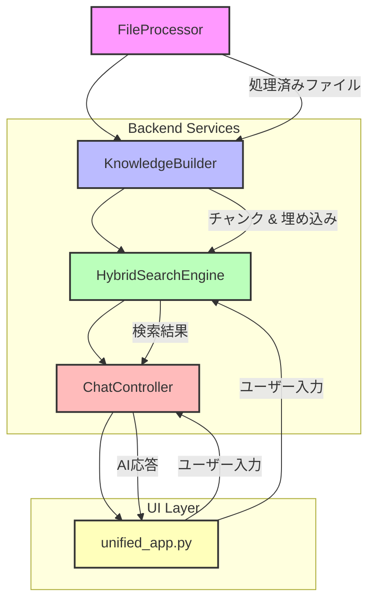

# KnowledgePlus: AIアシスタント統合ツール

KnowledgePlusは、ナレッジベース構築、検索、チャット、FAQ生成機能を統合したAIアシスタントアプリケーションです。Streamlitをベースに、OpenAIの埋め込み技術を活用し、独自のドキュメントに対する高度な情報活用を可能にします。

## 🚀 クイックスタート

### 依存関係のインストール

```bash
pip install -r requirements.txt
```

### OpenAI APIキーの設定

環境変数 `OPENAI_API_KEY` にAPIキーを設定してください。

```bash
export OPENAI_API_KEY=your_api_key_here
# またはWindowsの場合
set OPENAI_API_KEY=your_api_key_here
```

### IPAexGothicフォント

PDFエクスポートには日本語フォント `ipaexg.ttf` が必要です。<https://moji.or.jp/ipafont/> からダウンロードし、リポジトリのルートに配置してください。フォントが無い場合、エクスポートは失敗します。

### アプリケーションの起動

```bash
streamlit run unified_app.py
```

アップロードされたファイルや生成されたデータは `knowledge_base/<kb_name>` 以下に保存されます。デフォルトのナレッジベース名は `config.py` の `DEFAULT_KB_NAME` で定義されています。

## ✨ 主な機能

*   **検索中心のUI**: Googleのようなシンプルで直感的なインターフェースで、必要な情報に素早くアクセスできます。
*   **ドキュメントアップロード**: PDF, DOCX, XLSX, TXT, 各種画像ファイル、CADファイル（DXF, STL, STEPなど）をアップロードし、ナレッジベースを構築します。
*   **AIによる自動解析**: アップロードされたコンテンツはGPT-4oにより自動で解析され、詳細なメタデータが生成されます。
*   **ハイブリッド検索**: ベクトル検索とキーワード検索（BM25）を組み合わせることで、高精度な検索結果を提供します。
*   **AIチャット**: ナレッジベースの情報を参照しながら、AIと対話形式で質問応答が可能です。
*   **FAQ生成**: 既存のナレッジベースから自動でFAQ（よくある質問と回答）を生成します。

## 🏗️ アーキテクチャ

本アプリケーションは、以下の主要なコンポーネントで構成されています。



*   **FileProcessor**: さまざまなファイル形式（テキスト、画像、CADなど）を読み込み、検索可能なテキストや画像データに変換します。
*   **KnowledgeBuilder**: 変換されたファイルを意味のあるチャンクに分割し、OpenAIの埋め込み技術を用いてベクトル化し、ディスク上に保存します。これにより、ナレッジベースが構築されます。
*   **HybridSearchEngine**: ベクトル検索とキーワード検索（BM25）を組み合わせ、ナレッジベースから関連性の高い情報を効率的に検索します。
*   **ChatController**: 会話履歴を管理し、`HybridSearchEngine` から取得したコンテキストを基にGPTモデル（OpenAI API）を呼び出し、ユーザーの質問に対する応答を生成します。
*   **unified_app.py**: Streamlitを用いたユーザーインターフェースを提供し、上記のバックエンドコンポーネントを統合して、シームレスなユーザー体験を実現します。

## 🧪 テストの実行

自動テストスイートは `pytest` で実行できます。

```bash
pytest -q
```

## 📝 開発者ノート

詳細な設計については、[ui_design_plan.md](ui_design_plan.md) および [docs/integration_plan.md](docs/integration_plan.md) を参照してください。